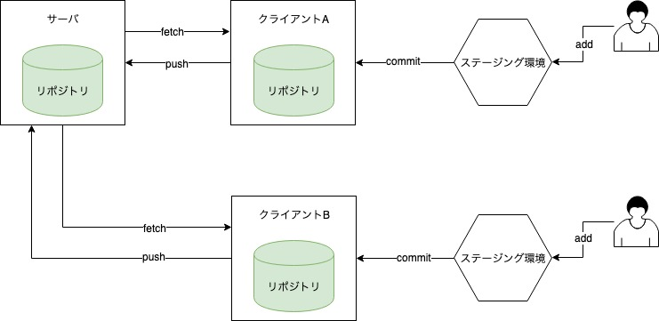
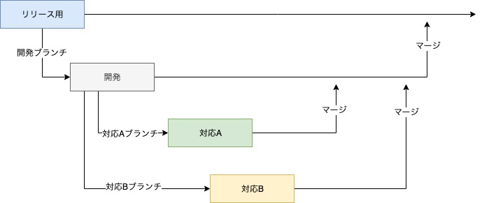

# Git

Gitを使った構成管理について学ぶ

## 対象

|   |   |
|---|---|
|目的 |Gitを一通り使えるようになる |
|対象 |Gitを使いたいと思っている人 |

## 目次

1. バージョン管理とは
2. Gitの特徴
3. とりあえずGitを使えるようにする
4. 基本的なコマンド操作
5. 強力なブランチの機能の概要
6. まとめ


## バージョン管理とは

一つのファイルやファイルの集合に対して時間とともに加えられていく変更を記録するシステムで、後で特定バージョンを呼び出すことができるようにするためのものである

バージョン管理でできること

- プロジェクトを以前の状態に戻すことができる
- 過去の変更履歴を確認できる
- 問題を混入した犯人探し（笑）etc

バージョン管理システムの種類

- 集中型
  - 製品
    - Subversion
    - CVS
  - 特徴
    - 一つのサーバに全ての情報を保持する
- 分散型
  - 製品
    - Git
    - Mercurial
  - 特徴
    - 一つのサーバとクライアントに全ての情報を保持する

## Gitの特徴

- ほとんどがローカル操作であるため、作業時に必ずしもネットワークにつながっている必要がない
- 完全性を持ち、Gitが感知しない場所での変更をすることができない
- 基本的にデータを追加するのみ

基本的なワークフローは以下の通りである

1. リモートリポジトリをローカルにコピーする
2. ファイルの修正をする
3. 修正したファイルをステージングエリアに追加する
4. ローカルリポジトリにコミットする(永久不変に保持するスナップショットとしてGitディレクトリに格納すること)
5. ローカルで作業が完了したら、リモートリポジトリにプッシュする



## とりあえずGitを使えるようにする

下記のリンクから取得できます

- [Git-Windows] (http://msysgit.github.com/)
- [Git-Mac] (http://sourceforge.net/projects/git-osx-installer/)

コンフィグの設定

```
$ git config --global user.name "ユーザ名"
$ git config --global user.email メールアドレス

$ config --list
```

## 基本的なコマンド操作

リモートリポジトリをローカルにコピーする
```
$ git clone [url]
```

差分を確認してファイルをステージング状態にする
```
$ git diff
$ git add ファイル名
```

ステージングしたファイルをコミットする
```
$ git commit -m "コミットメッセージ"
```

リモートリポジトリにコミットした内容を反映させる
```
$ git push origin ブランチ名
```

その他のよく使うコマンド
```
$ git log   ・・・コミット履歴を確認できる
$ git rm    ・・・コミットされたファイルに対してrmコマンドを実行する
$ git mv    ・・・コミットされたファイルに対してmvコマンドを実行する
$ git reset HEAD ファイル名     ・・・ステージングを解除する
$ git remote show origin      ・・・リモートの情報を取得
$ git pull  ・・・データを取得し、現在作業中のコードへのマージを行う
$ git tag   ・・・タグを表示する

...etc
```

たくさんのコマンド/オプションがあるので紹介しきれません、、、ググってみてください

## 強力なブランチの機能の概要

Gitにはブランチという強力な機能があります。この機能のおかげで、複数人が同時に開発することができるのです。

ザックリした概要は以下の通りです。



開発ブランチを汚すことなく、作業者は開発することができます。また、評価者が意図しないファイルの更新を防ぐこともできます。また、Gitには強力なマージ機能があるので、大体は自動でマージしてくれます。(たまにコンフリクトしますが、、、)

    その理由としてマージする際に必ずレビューが入ります。GitHubでいうところのプルリクエストです。この機能があるおかげで、権限がないものがリモートリポジトリを勝手に変更することを防ぎます。リリース用ブランチの変更権限をPMがもち、開発ブランチの変更権限をPLが持つようなことを明確に定義することができます。

## まとめ

本日の勉強会はここまでです

とりあえず、Gitを使ってリモートリポジトリにプッシュできるようになったと思います。

次はリポジトリホスティングサービスのGitHubについてまとめたいと思います

## 参考

- [Git] (https://git-scm.com/book)